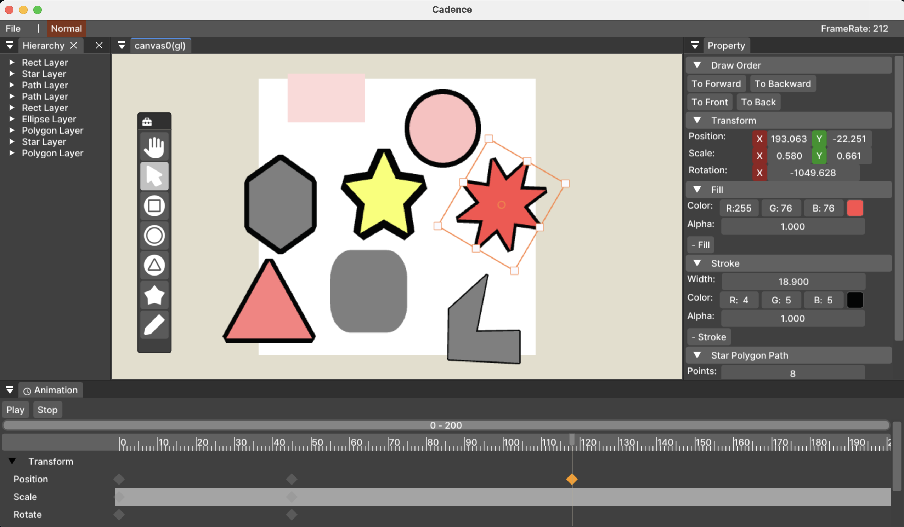

# Cadence

Vector Graphics Animation Editor

## **Building the Project**

see docs/01.build.md

## **TODO**

- Import/Export
    - lottie, gif
- Physics Animation
- Sound System
- Auto Save
- Copy/Delete 
- MultiSelection
- Group Layer 
- Nested Scene
- Bone, Rigging
- Align
- State Macine

## **Dependencies**

- **ThorVG**: The core graphics library that the simulator is built upon.

- **ImGUI**: A graphical user interface library used for rendering the simulator's UI.

- **SDL2**: A cross-platform library for handling windows, io events

- **spdlog**: Log library

- **entt**: Entity Component System library
